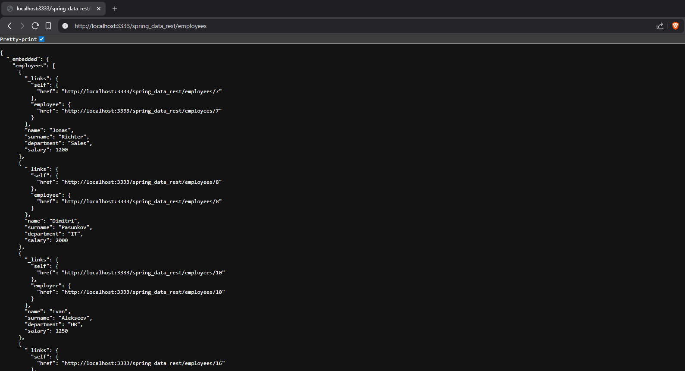

# 🚀 Spring Boot Data REST – Employee Management

🌐 A RESTful CRUD application built with Spring Boot and Spring Data REST.

This project demonstrates how to eliminate the controller and service layers by exposing database entities directly as REST endpoints using Spring Data REST.

---

## 📌 Project Overview

This is a **Spring Boot application** that provides a fully functional REST API automatically generated from a `JpaRepository`.

Unlike traditional Spring MVC applications, this project does NOT contain:

- ❌ Controllers  
- ❌ Service layer  
- ❌ DAO implementations  

Instead, Spring Data REST automatically exposes repository methods as REST endpoints.
---

## 🧠 Architecture
Repository → Entity → REST API (auto-generated)

---

## ✨ Features

- ✅ Full CRUD operations without controllers
- 🌐 Automatically generated REST API
- 📦 JSON data exchange
- 🗄 Spring Data JPA integration
- ⚡ Minimal boilerplate code
- 🚀 Embedded Tomcat server
- 📊 Spring Boot Actuator support

---

## Screenshots

### Employee List


## 🛠 Requirements

- ☕ Java 8 or higher
- 📦 Maven
- 🐬 MySQL 8.x
- 💡 IntelliJ IDEA (recommended)

## 🚀 How to Run

### 1️⃣ Clone the repository

Clone this repository to your local machine:
```bash
git clone https://github.com/YOUR_USERNAME/spring-boot-data-rest.git
```

Or download it as a ZIP archive and extract it.

### 2️⃣ Open the project in IntelliJ IDEA

- Open IntelliJ IDEA
- Select File → Open
- Choose the root project folder spring_course_rest
- IntelliJ will automatically detect two Maven modules
- Make sure all Maven dependencies are downloaded successfully

### 3️⃣ Install and configure MySQL

Make sure **MySQL is installed and running** on your computer.

- MySQL version: **8.x**
- Default port: **3306**

You can check MySQL installation by running:

```bash
mysql --version
```

Or by opening MySQL Workbench.

### 4️⃣ Create a local database

Open MySQL Workbench (or terminal) and run:

```sql
CREATE DATABASE my_db;
USE my_db;
```
Create table
```sql
CREATE TABLE employees (
  id INT NOT NULL AUTO_INCREMENT,
  name VARCHAR(15),
  surname VARCHAR(25),
  department VARCHAR(20),
  salary INT,
  PRIMARY KEY (id)
);
```
(Optional) Add test data
```sql
INSERT INTO employees (name, surname, department, salary) VALUES
('Lucas', 'Neumann', 'IT', 1200),
('Sophie', 'Keller', 'HR', 900),
('Maria', 'Klein', 'Sales', 950);
```

✅ Database is ready.


### 5️⃣ Configure database credentials (Server)

Open the configuration file:

```markdown
src/main/resources/application.properties
```

Update credentials:

```java
spring.datasource.url=jdbc:mysql://localhost:3306/my_db?useSSL=false
spring.datasource.username=bestuser
spring.datasource.password=bestuser
```

You can change the following properties:

spring.datasource.url → database name and connection URL

spring.datasource.username → MySQL username

spring.datasource.password → MySQL password


Make sure the database name matches the one created in MySQL.


### 6️⃣ Run the Application (Main class SpringBootRestApplication)

Run main class:
```markdown
SpringbootDataRestApplication.java
```
### 7️⃣ Test API in browser or Postman

Base URL:
```url
http://localhost:3333/spring_data_rest/employees
```

### 📡 API Endpoints
| Method | Endpoint             | Description        |
|--------|----------------------|--------------------|
| GET    | /employees       | Get all employees  |
| GET    | /employees/{id}  | Get employee by ID |
| POST   | /employees       | Create new employee|
| PUT    | /employees/{id}  | Update employee    |
| DELETE | /employees/{id}  | Delete employee    |


### 🧪 Example JSON

Update employee (PUT)
```json
{
  "name": "Jonas",
  "surname": "Richter",
  "department": "Sales",
  "salary": 1600
}
```
Note:
The id is not included in the request body. It is passed in the URL path:
```url
PUT /employees/{id}
```

### 📡 Spring Boot Actuator Endpoints
| Endpoint             | Description        |
|----------------------|--------------------|
| /actuator/health     | Application health status   |
| /actuator/info | Application information |
| /actuator/beans       | Information about Spring container beans|
| /actuator/mappings  | All registered endpoints    |

## ⚙️ Technologies Used

- Spring Boot
- Spring Data JPA
- Spring Data REST
- Hibernate
- MySQL
- Maven
- Spring Boot Actuator

## ℹ️ Important Notes

- No controllers are implemented manually
- API is fully generated by Spring Data REST
- Repository interface is the only entry point to database
- Useful for rapid prototyping, NOT for complex business logic

🎯 Learning Goals

This project demonstrates:

- How Spring Data REST eliminates controller layer
- How JpaRepository can expose full REST API
- Auto-generated CRUD endpoints
- Difference between traditional REST and Spring Data REST approach
